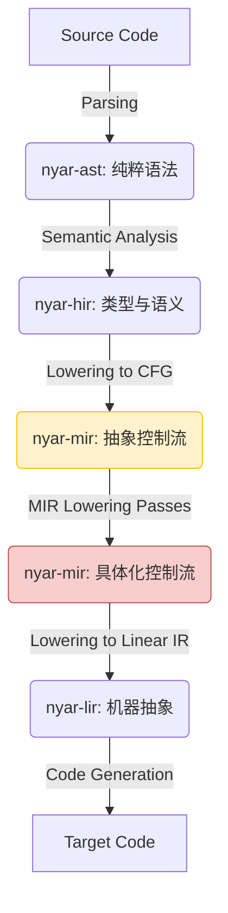

# Nyar 编译器架构与维护者圣经

**文档版本**: 5.0 (Definitive Edition)
**目标读者**: Nyar 项目的核心开发者、维护者与贡献者

## 序言：铸造未来的编译器

欢迎踏上 Nyar 的深度探索之旅。这份文档不仅是一份技术说明，更是 Nyar 项目的设计哲学、架构蓝图与工程文化的集中体现。Nyar 的诞生源于一个宏大的愿景：构建一个高性能、可扩展的编译器**基础设施**，它不仅能驱动一门语言，更能成为未来众多静态类型语言赖以生存的基石。

我们的核心使命是彻底瓦解现代编程语言设计中的“不可能三角”——我们坚信，**富有表达力的高级抽象**、**极致的运行时性能**与**闪电般的开发反馈**可以共存。本指南将为您揭示，我们是如何通过分层抽象、增量计算和精心的工程设计，将这一愿景变为现实的。

作为一名维护者，您即将深入一个遵循现代编译器设计最佳实践的复杂系统。请将本指南作为您的地图与罗盘，它将引导您穿越从源代码到机器码的壮丽风景，理解每一个架构决策背后的深思熟虑，并最终赋予您自信地驾驭、优化和扩展 Nyar 的能力。

---

## Part I: 顶层设计与指导哲学

*本部分阐述了驱动 Nyar 所有技术决策的宏观原则。理解这些原则，是理解 Nyar 为何如此设计的关键。*

### 第 1 章：Nyar 的四大支柱

Nyar 的架构建立在四大核心原则之上，它们如同灯塔，指引着项目的演进方向。

#### 1.1 原则一：编译器即框架 (Compiler as a Framework)

Nyar 从设计之初就超越了为单一语言服务的范畴，它是一个可被广泛复用的编译器框架。

*   **前端无关性**: `nyar-ast` 定义了一个标准的、语言无关的抽象语法树。任何语言只要能编写一个解析器将其源代码转换为 `nyar-ast`，就能即刻“接入”Nyar 强大的中端和后端，免费获得类型检查、世界级的优化和多目标代码生成的能力。
*   **后端可插拔**: `nyar-lir` 是一个精心设计的、与目标机器无关的低级 IR。这使得为 Nyar 添加新的代码生成后端（如 LLVM、原生 x86-64、ARM、RISC-V）成为一个清晰、模块化的任务。
*   **语言核心与工具分离**: 我们将在附录中看到，Valkyrie 语言的实现将“编译器”本身封装成一个库 (`nyar_valkyrie`)。命令行工具和语言服务器等都是这个库的客户端。这种模式极大地促进了代码复用和生态系统的一致性。

这一原则意味着对 Nyar 核心的一次优化，将像涟漪一样扩散，惠及所有基于此框架构建的语言生态。

#### 1.2 原则二：渐进式降低 (Progressive Lowering)

编译的本质是一个不断消除抽象、增加具体性的过程。Nyar 将这个复杂的过程分解为一系列管理良好、职责单一的步骤，每个步骤都由一个专门的中间表示（IR）来承载。这趟旅程是单向且不可逆的，每一层 IR 都比上一层更接近物理机器。



*   **从 AST 到 HIR**: 赋予代码以意义（类型、作用域）。
*   **从 HIR 到 MIR**: 抛弃语法结构，聚焦于计算和控制流。
*   **在 MIR 内部降级**: 将高级语义（如动态派发）具体化为底层机制（如 VTable 访问）。
*   **从 MIR 到 LIR**: 将变量映射到栈和寄存器，将操作映射到虚拟指令。

这种分层设计将巨大的复杂性分解为一系列可控的小问题，使得每一层的实现、测试和优化都可以独立进行，极大地降低了维护者的心智负担。

#### 1.3 原则三：增量为本 (Incremental by Design)

在追求极致开发体验的今天，快速的反馈循环是不可或缺的。Nyar 将增量计算作为其架构的核心，而非一个事后添加的功能。这一切都由 `nyar-query` crate 中集成的 **Salsa 框架** 驱动。

Salsa 将整个编译过程建模为一个由相互依赖的**查询 (Queries)** 构成的有向无环图（DAG）。

*   **编译器是数据库**: 所有的编译活动，如“解析文件”、“类型检查函数”、“生成 MIR”，都被封装成可以被缓存的查询。
*   **自动依赖追踪**: Salsa 自动、精确地追踪查询之间的依赖关系。`typecheck_function(f)` 依赖于 `hir_of_function(f)`，后者又依赖于 `ast_of_file(...)`。
*   **按需智能重计算**: 当一个源文件被修改时，只有该文件对应的 `source_text` 查询及其所有**直接或间接的下游依赖项**会被标记为“脏”。下次编译时，只有这些脏查询会被重新计算，所有其他结果都将从缓存中以微秒级的速度获取。

这使得 Nyar 在修改少量代码后的重编译速度极快，为语言服务器（LSP）等需要即时反馈的工具提供了完美的架构基础。

#### 1.4 原则四：开发者体验至上 (Developer Experience First)

这里的“开发者”既包括使用 Nyar 生态语言的最终用户，也包括维护 Nyar 自身的我们。

*   **对用户**:
    *   **卓越的错误诊断**: 通过 `nyar-error` 和 `miette` 库，我们致力于提供清晰、带有上下文、指向性强、甚至给出修复建议的错误信息。
    *   **可预测的性能**: 我们的核心承诺是“零成本抽象”。泛型、Trait 等高级特性在编译时被彻底解析和优化，确保用户不必为代码的优雅和表达力付出任何运行时性能代价。
*   **对维护者**:
    *   **清晰的模块边界**: Rust 的 Workspace (Monorepo) 结构和严格的模块系统，使得代码库易于导航、理解和贡献。
    *   **坚不可摧的测试套件**: 单元测试、集成测试和快照测试共同构成了强大的质量安全网，让我们可以自信地进行大规模重构和添加新功能。
    *   **健壮的工程实践**: 统一的格式化、静态分析（Clippy）和持续集成（CI）流程，保证了代码库的长期健康和可维护性。

---

## Part II: Nyar 核心框架深度剖析

*本部分是文档的技术核心，将逐一深入介绍每个构成 Nyar 框架的、与语言无关的组件。*

### 第 2 章：框架解剖学：Crate 组织与依赖

Nyar 采用 Rust Workspace (Monorepo) 的形式，将整个系统分解为 `projects/` 目录下的多个逻辑内聚的 crate。

#### 2.1 核心 Crate 依赖关系图

```mermaid
graph TD
    subgraph Foundation
        A[nyar-core]
        B[nyar-error]
        C[nyar-query]
    end
    
    subgraph IR Pipeline
        D[nyar-ast]
        E[nyar-hir]
        F[nyar-mir]
        G[nyar-lir]
    end
    
    subgraph Core Logic & Backends
        H[nyar-interpreter]
        I[nyar-wasm]
        J[nyar-js]
    end

    %% Dependencies
    A --> B; A --> C; A --> D;
    B --> E; B --> F; B --> G; B --> H;

    D --> E;
    E --> F;
    F --> G; F --> H;
    G --> I; G --> J;

    style Foundation fill:#cde4ff,stroke:#6699ff
    style "IR Pipeline" fill:#fff2cc,stroke:#ffbf00
    style "Core Logic & Backends" fill:#d5e8d4,stroke:#82b366
```

### 第 3 章：基础层 (The Foundation)

基础层是整个编译器的基石，提供了所有其他组件共享的通用能力。

#### 3.1 `nyar-core`: 通用数据结构

*   **使命**: 定义贯穿整个编译器的基础数据结构和标识符，确保全域一致性。
*   **关键组件**:
    *   **ID 系统**: 为程序中的实体（文件、函数、类型、变量等）提供唯一的、类型安全的、可高效存储和比较的标识符（例如 `FileId`, `FunctionId`）。这避免了直接传递复杂对象，简化了接口。
    *   **字符串驻留 (String Interning)**: 通过一个全局的 `SymbolTable`，将所有字符串（如变量名）转换为一个唯一的 `Symbol` (通常是一个 `u32`)。这极大地减少了内存占用，并将字符串比较转换为廉价的整数比较。
    *   **源码位置追踪 (`Span`)**: `Span` 结构体精确记录每个语法元素在源代码中的起止位置，是生成高质量错误信息的生命线。

#### 3.2 `nyar-error`: 统一诊断系统

*   **使命**: 提供一个统一的、功能强大的错误报告和诊断框架。
*   **关键组件**:
    *   **结构化错误**: 使用 `thiserror` 宏定义各种编译器阶段可能产生的结构化错误 `enum`。
    *   **美观渲染**: 集成 `miette` 库，将结构化错误渲染成用户友好的、带有源码片段、高亮、标签和帮助信息的多彩诊断报告。

#### 3.3 `nyar-query`: 增量计算引擎

*   **使命**: 编排整个编译流水线，并为其提供增量、缓存和并行计算的能力。
*   **核心概念**:
    *   **`trait XxxDatabase`**: 每个编译阶段（如 HIR）都定义一个包含其所有查询的 `trait` (e.g., `HirDatabase`)。
    *   **`#[salsa::tracked]`**: 标记一个函数或结构体，Salsa 会自动为其实现缓存和依赖追踪。
    *   **输入 (Inputs)**: 特殊的查询，可以由外部（如语言服务器）修改。当输入改变时，Salsa 运行时会自动使所有依赖于它的缓存失效。
    *   **数据库 (`Database`)**: 一个实现了所有 `XxxDatabase` trait 的 `struct`，是所有编译状态的中央存储。

### 第 4 章：中间表示（IR）的史诗之旅

这是编译器的核心叙事线。代码将在这里被逐步分析、优化和转换，每一步都走向更低的抽象层次。

#### 4.1 `nyar-ast`: 语法的忠实镜像

*   **抽象层级**: 语法层。
*   **数据结构**: 树状结构，节点（`struct` 和 `enum`）直接对应语言的语法产生式。
*   **核心职责**:
    1.  **标准输入**: 作为 Nyar 框架的**标准输入接口**。任何前端解析器的唯一目标就是生成 `nyar-ast`。
    2.  **语法脱糖 (Desugaring)**: 在进入语义分析前，进行初步的语法转换。例如，将 `for` 循环转换为更底层的 `loop` 和 `match` 结构，这简化了后续分析器的负担，因为它们只需处理更少的核心语法。
*   **知识局限**: AST 只关心“代码写了什么”（语法），而不关心“代码是什么意思”（语义）。它不知道变量的类型，也不知道一个函数名指向哪个具体的函数。

#### 4.2 `nyar-hir`: 语义的觉醒

*   **抽象层级**: 语义层。
*   **数据结构**: 仍然是树状结构，但节点被大量**语义信息**所注解。
*   **核心职责**:
    1.  **名称解析 (Name Resolution)**: 构建作用域，并将 AST 中所有标识符（变量、函数名）精确地解析到其唯一的声明处。
    2.  **类型推导与检查 (Type Inference & Checking)**: 使用基于约束的类型推断算法（类似 Hindley-Milner），为程序中的每一个表达式都赋予一个确切的类型。这是后续所有优化的安全基石。
    3.  **Trait 解析**: 解析 `trait` 定义和 `impl` 块，构建一个复杂的查询系统，用于回答“类型 `T` 是否实现了 Trait `U`？”以及“方法 `foo` 在这个调用点解析到哪个具体实现？”等问题。
    4.  **高级结构性优化**:
        *   **函数内联 (Inlining)**: 基于成本模型（函数大小、调用频率等），将函数调用替换为函数体。这是最强大的优化之一，因为它打破了函数边界，为后续 MIR 层的优化（如常量传播）创造了广阔的机会。
*   **知识水平**: HIR 是编译器首次**完全理解**代码的表示。它拥有全局的、精确的类型和作用域信息。

#### 4.3 `nyar-mir`: 优化的熔炉

*   **抽象层级**: 控制流层。
*   **数据结构**: **控制流图 (Control Flow Graph, CFG)**。函数体被分解为一系列**基本块 (Basic Blocks)**，每个块是一段无分支的指令序列，块的末尾是一个**终结符 (Terminator)**（如 `Goto`, `If`, `Return`），决定了下一个执行哪个块。
*   **核心职责**: MIR 是所有经典编译器优化的核心平台。它的设计精髓在于其**分阶段降级**的特性。

##### 4.3.1 第一阶段：高级 MIR (High-Level MIR)

这是 MIR 刚从 HIR 生成时的状态，它专注于控制流和数据流，但仍然保留了相当多的高级语义。

*   **特点**:
    *   **抽象 `Place`**: 变量和内存位置被表示为抽象的 `Place`，而不是具体的内存地址或寄存器。
    *   **无指针概念**: 在这个阶段，没有原始指针。例如，一个 Trait Object `&dyn Logger` 被表示为一个聚合类型，包含一个数据 `Place` 和一个抽象的**元数据令牌 (Metadata Token)**，这个令牌逻辑上指向对应的 `impl`，但它**不是**一个 VTable 指针。
    *   **抽象派发**: 动态方法调用被表示为一个特殊的指令，明确标记其动态派发的**意图**，但不涉及具体实现机制：
        ```mir
        // Conceptual High-Level MIR Instruction
        _retval = Call {
            target: <Logger as Trait>::log, // A symbolic representation
            from_place: item,               // The trait object `place`
            kind: DynamicDispatch,          // The INTENT
        }
        ```
*   **在此阶段的优化**:
    *   **常量传播与折叠**: 在编译时计算常量表达式。
    *   **死代码消除 (DCE)**: 基于活跃变量分析，移除永不执行或结果永不使用的代码。
    *   **公共子表达式消除 (CSE)**: 消除重复计算。
    *   **循环不变量外提 (LICM)**: 将循环内部但结果不变的计算移到循环之前。
    *   这些优化得益于 MIR 的高级抽象，它们可以在不关心内存布局或调用约定的情况下运行。

##### 4.3.2 第二阶段：MIR 降级遍 (MIR Lowering Passes)

在核心优化之后，一系列特殊的“降级”遍会运行，其唯一目的是将高级 MIR 概念具体化，为生成 LIR 做准备。

*   **关键转换**:
    1.  **VTable 具象化**: 编译器此时会扫描所有 Trait 实现，为每个 `(Type, Trait)` 组合**生成静态的 VTable 数据**，并确定其内存布局。
    2.  **胖指针具体化**: 之前抽象的 Trait Object `Place` 现在被降级为一个具体的、包含两个字段的结构：`{ data_ptr: *mut (), vtable_ptr: *const VTable }`。
    3.  **动态派发降级**: 之前那个抽象的 `DynamicDispatch` 调用，现在被**重写**为一个更具体的操作序列：
        ```mir
        // Conceptual Low-Level (Lowered) MIR
        _vtable_ptr = item.1; // Project to the vtable_ptr field
        _fn_ptr_addr = AddressOf(_vtable_ptr, offset_of_log_method);
        _fn_ptr = Load(_fn_ptr_addr);
        _data_ptr = item.0; // Project to the data_ptr field
        _retval = CallIndirect {
            target: _fn_ptr,
            args: (_data_ptr, ...),
        };
        ```
*   **知识水平**: 降级后的 MIR 变得非常具体。它现在明确包含了指针、内存偏移量和间接函数调用的概念。它为 LIR 提供了一个清晰、无歧义的指令序列蓝图。

#### 4.4 `nyar-lir`: 机器的前奏

*   **抽象层级**: 虚拟指令集层。
*   **数据结构**: 函数表示为线性的虚拟指令序列。
*   **核心职责**: 专注于硬件相关的优化和资源管理。
    1.  **指令选择 (Instruction Selection)**: 将 MIR 的操作（如 `Add`, `Load`）转换为 LIR 中更具体的虚拟指令，这些指令与目标机器的指令集有更紧密的对应关系。
    2.  **寄存器分配 (Register Allocation)**: 这是 LIR 最核心、最复杂的任务。使用**基于图着色的算法**，将最频繁使用的变量和临时值分配到有限的物理寄存器中。
        *   **干扰图**: 构建一个图，节点是变量，边表示两个变量的生命周期有重叠（不能使用同一个寄存器）。
        *   **着色**: 尝试用 K 种颜色（代表 K 个可用寄存器）为图着色。
        *   **溢出 (Spilling)**: 如果寄存器不足，启发式地选择一些变量将它们“溢出”到函数栈帧上，并在每次使用时生成加载/存储指令。
    3.  **指令调度 (Instruction Scheduling)**: 在不改变程序语义的前提下，重排指令顺序以最大化现代 CPU 的指令级并行能力，避免流水线停顿，隐藏内存访问延迟。

### 第 5 章：智能核心：`nyar-interpreter` 与编译时执行

`nyar-interpreter` 是 Nyar 架构的“秘密武器”，它是一个在编译器内部运行的 MIR 解释器，承担着两大关键职责。

#### 5.1 编译时函数执行 (CTFE)

*   **能力**: Nyar 允许将某些函数标记为 `comptime`，这些函数将在编译期间由 `nyar-interpreter` 执行，其结果将作为常量直接嵌入到最终的程序中。
*   **应用**: 可用于复杂的常量计算、生成静态查找表、进行编译时断言等。

#### 5.2 按需单态化 (On-Demand Monomorphization)

这是 Nyar 实现零成本泛型的核心秘诀，它摒弃了盲目实例化所有泛型用法的传统方法。

*   **机制 (基于工作列表的迭代算法)**:
    1.  **种子**: 编译开始时，将程序的入口点（如 `main` 函数）放入一个“工作列表”队列中。
    2.  **迭代**: 编译器从工作列表中取出一个函数进行分析。
    3.  **发现**: 当在函数中遇到一个对泛型的新调用时，例如 `Vec::<i32>::new()`，编译器会检查这个具体实例是否已经被生成过。
    4.  **按需生成**:
        *   **如果未生成**: 编译器会加载 `Vec::<T>::new()` 的泛型 MIR **模板**，用 `i32` 替换所有 `T`，生成一个新的、完全具体的 MIR 函数，命名为类似 `Vector<i32>::new::MONOMORPHIZED`。
        *   **加入队列**: **这个新生成的函数本身也会被加入到工作列表的末尾**，等待后续分析（因为它可能也会调用其他泛型函数）。
        *   **替换调用**: 原始的泛型调用点被替换为一个对这个新生成的具体函数的直接调用。
    5.  **不动点**: 这个过程会一直持续，直到工作列表为空。此时，所有从入口点**可达**的代码路径中遇到的泛型调用都已被实例化。任何在代码库中定义但从未被调用的泛型实例，将永远不会被生成代码，从而完美地避免了代码膨胀。

---

## Part III: 工程实践与贡献指南

*在深入理解了 Nyar 的核心架构之后，本部分将为您提供参与项目开发所需的全部实践知识。*

### 第 6 章：开发工作流

*   **环境设置**: Rust 工具链, `rust-analyzer`。
*   **核心命令**:
    *   `cargo build --workspace`: 构建所有 crate。
    *   `cargo test --workspace`: 运行所有测试。
    *   `cargo clippy --workspace -- -D warnings`: 进行静态分析并报告问题。
*   **调试**: 使用 `lldb`/`gdb` 进行原生调试。在代码中广泛使用 `tracing` 库进行结构化日志输出，以理解编译器的内部决策。

### 第 7 章：测试哲学

*   **单元测试**: 每个 crate 内部的 `#[cfg(test)]` 模块，用于测试内部逻辑。
*   **快照测试 (`insta`)**: 这是验证复杂 IR 输出（如 AST, HIR, MIR, LIR）的**黄金标准**。它将 IR 的文本表示存储在文件中，任何非预期的更改都会导致测试失败，使得审查和接受 IR 的变化变得简单而可靠。
*   **集成测试**: 在根目录的 `tests/` 目录下，编写端到端的测试用例，从 Valkyrie 源代码文件一直编译到最终产物，验证整个流程的正确性。

### 第 8 章：如何贡献

*   **通用流程**: Fork -> Create Branch -> Code -> Write Tests -> PR。
*   **专题指南：添加一个 MIR 优化遍**:
    1.  **定位**: 在 `nyar-mir/src/optimizations/` 目录下创建新模块。
    2.  **实现**: 实现一个函数，它接收一个 `&mut MirFunction`，并对其进行原地修改。
    3.  **测试**: 编写快照测试，提供优化前的 MIR 代码，并断言优化后的 MIR 快照符合预期。
    4.  **集成**: 将您的优化遍添加到 MIR 的优化管道管理器中，并考虑它应该在哪个优化级别 (`-O1`, `-O2` 等) 启用。
*   **专题指南：修复一个 Bug**:
    1.  **编写回归测试**: 第一步永远是编写一个能够稳定复现该 bug 的最小化测试用例。这个测试现在应该是失败的。
    2.  **定位与修复**: 利用调试器和日志，追踪并修复错误的逻辑。
    3.  **验证**: 再次运行测试，确保您新加的测试用例现在可以通过，并且没有破坏任何现有的测试。

---

## 附录 A: Valkyrie 语言实现 - 终极案例研究

*本附录展示了如何将 Part II 中描述的 Nyar 核心框架，组装成一个功能完整的、名为 Valkyrie 的编程语言及其工具链。这完美地诠释了“编译器即框架”的设计哲学。*

### A.1 核心架构：编译器即库

Valkyrie 的实现遵循一个核心原则：**将“Valkyrie 编译器”本身实现为一个库 (`nyar_valkyrie`)**。所有面向用户的工具，如命令行编译器或语言服务器，都是这个核心库的**客户端**。

```mermaid
graph TD
    subgraph Tooling Layer (Clients)
        A[CLI Binary (`nyar_cli`)]
        B[LSP Server (`valkyrie-lsp`)]
        C[Doc Generator, Formatter, etc.]
    end

    subgraph Language Integration Library
        D{nyar_valkyrie (The Core Library)}
    end

    subgraph Nyar Core Framework
        E[valkyrie-parser, nyar-query, nyar-hir, ...]
    end

    A -- Calls Public API --> D
    B -- Calls Public API --> D
    C -- Calls Public API --> D

    D -- Integrates & Orchestrates --> E

    style D fill:#f8cecc,stroke:#b85450,stroke-width:2px
```

### A.2 `valkyrie-parser`: 语言之门

*   **角色**: 源代码到 `nyar-ast` 的**翻译器**。
*   **职责**: 实现 Valkyrie 语言的词法和语法分析，它是连接 Valkyrie 特定语法与 Nyar 通用框架的桥梁。

### A.3 `nyar_valkyrie`: 集成与封装的核心

*   **角色**: **Valkyrie 语言的“编译会话”库**。这是 Valkyrie 实现的心脏。
*   **职责**:
    1.  **定义终极 Salsa 数据库**: 定义最终的 `ValkyrieDatabase`，它继承了所有 Nyar 核心框架的数据库 `trait`。
    2.  **实现“胶水”查询**: 实现连接不同编译阶段的顶层查询，例如，一个 `compile_file` 查询，它内部会依次调用解析、类型检查、优化和代码生成的查询。
    3.  **提供高级公共 API**: 向外部工具暴露一个稳定、高级的 API，隐藏内部复杂的编译细节。例如：
        *   `fn compile_workspace(...) -> CompilationResult`
        *   `fn get_semantic_tokens(...) -> Vector<Token>`
        *   `fn find_definition(...) -> Option<Location>`

### A.4 `valkyrie-lsp`: 增量计算的极致体现

*   **角色**: IDE 支持的后端服务，`nyar_valkyrie` 库的一个**旗舰客户端**。
*   **职责**:
    *   **维护一个 `nyar_valkyrie` 实例**: LSP 进程会实例化并持有一个长生命周期的编译会话。
    *   **将 LSP 请求翻译为 API 调用**: 当收到编辑器的 `textDocument/hover` 请求时，LSP 会调用 `nyar_valkyrie::get_hover_info(...)`。
    *   **利用增量计算**: 当用户编辑文件时，LSP 通过 `nyar_valkyrie` 的 API 更新 Salsa 数据库中的源文件内容。得益于 Salsa，下一次 `get_hover_info` 的调用将是**极快**的，因为它只会重新计算受影响的最小代码子集。

### A.5 `nyar_cli`: 批处理客户端

*   **角色**: 传统的命令行编译器，`nyar_valkyrie` 库的另一个简单客户端。
*   **职责**:
    *   解析命令行参数。
    *   实例化一个**一次性**的 `nyar_valkyrie` 编译会话。
    *   调用 `nyar_valkyrie::compile_workspace(...)`。
    *   将结果打印到终端。

## 结语：永无止境的旅程

您已经完成了对 Nyar 架构的全面概览。我们已经看到，通过分层 IR、增量计算、以及将编译器作为库的精心设计，Nyar 构建了一个既强大又灵活的基础设施。

然而，编译器的优化永无止境。未来的道路充满了激动人心的挑战和机遇：实现 LLVM 后端以生成最顶级的原生代码、集成 Profile-Guided Optimization (PGO) 以进行数据驱动的优化、在语言和编译器层面支持高级并发……

Nyar 的旅程才刚刚开始。我们期待与您一起，在这条追求极致性能与完美开发体验的道路上，不断探索，共同前进。欢迎加入我们！