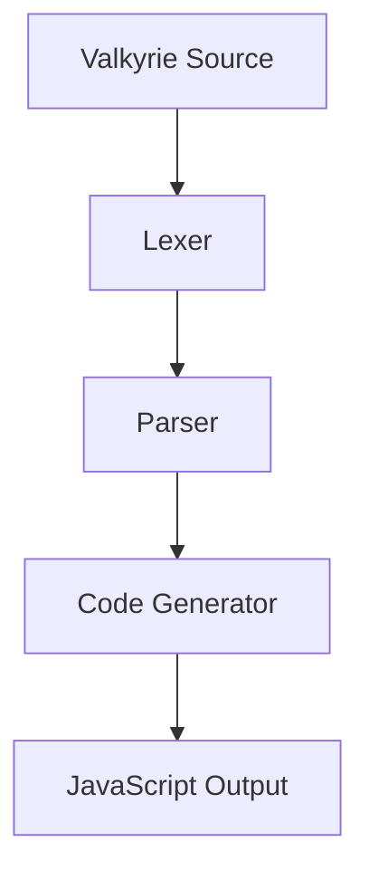

# Valkyrie Language Documentation

[](https://opensource.org/licenses/MIT)
[](https://valkyrie-document.netlify.app)
[](https://github.com/nyar-lang/valkyrie-vm/actions)

## 📖 项目概述

这是 Valkyrie 编程语言的官方文档站点，基于 VitePress 构建，提供全面的语言规范、教程和示例代码。

Valkyrie 是一个现代化的多范式编程语言，专注于编译器自举技术和高性能运行时系统。本文档站点旨在为语言用户、编译器开发者和语言设计者提供完整的学习和参考资料。

## 🎯 文档结构

### 用户指南
- **[入门指南](guide/getting-started.md)** - 快速开始 Valkyrie 编程
- **[语言特性](guide/features.md)** - Valkyrie 的核心语言特性
- **[示例代码](examples/)** - 实际应用场景示例

### 语言参考
- **[语言规范](language/)** - 详细的语言语法和语义
- **[标准库](language/standard-library.md)** - 内置函数和类型
- **[编译器选项](language/compiler-options.md)** - 编译器配置和使用

### 开发文档
- **[维护指南](maintenance/)** - 项目维护和开发流程
- **[构建系统](maintenance/build-system.md)** - 构建和部署配置
- **[发布流程](maintenance/release-process.md)** - 版本发布和变更管理

### 应用示例
- **[Web 开发](examples/web-development/)** - 前端和后端开发示例
- **[科学计算](examples/scientific-computing/)** - 数值计算和数据分析
- **[机器学习](examples/machine-learning/)** - AI 和机器学习应用
- **[游戏开发](examples/game-development/)** - 游戏引擎和图形编程
- **[嵌入式开发](examples/embedded-development/)** - 物联网和嵌入式系统
- **[定理证明](examples/theorem-proving/)** - 形式化验证和证明助手

## 🚀 快速开始

### 本地开发

```bash
# 进入文档项目目录
cd projects/valkyrie-document

# 安装依赖
pnpm install

# 启动开发服务器
pnpm run dev

# 构建文档
pnpm run build

# 预览构建结果
pnpm run preview
```

### 部署配置

文档站点配置为自动部署到 Netlify：

- **生产环境**: https://valkyrie-document.netlify.app
- **构建命令**: `pnpm run build`
- **发布目录**: `.vitepress/dist`

## 🛠️ 技术栈

### 文档框架
- **[VitePress](https://vitepress.dev/)** - 现代静态站点生成器
- **[Vue.js](https://vuejs.org/)** - 渐进式 JavaScript 框架
- **[Markdown](https://www.markdownguide.org/)** - 文档编写格式

### 增强功能
- **[Shiki](https://shiki.matsu.io/)** - 语法高亮引擎
- **[Mermaid](https://mermaid-js.github.io/)** - 图表和流程图
- **[KaTeX](https://katex.org/)** - 数学公式渲染
- **[Vite PWA](https://vite-pwa-org.netlify.app/)** - 渐进式 Web 应用

### 部署和托管
- **[Netlify](https://www.netlify.com/)** - 静态站点托管
- **[GitHub Actions](https://github.com/features/actions)** - 持续集成和部署

## 📊 项目状态

### ✅ 已完成内容
- 基础文档框架搭建
- VitePress 主题和配置
- 导航结构和侧边栏
- 语法高亮和代码块
- 响应式设计支持
- 搜索功能集成

### 🔄 进行中内容
- 语言规范文档完善
- 教程和示例代码
- API 文档生成
- 多语言支持准备
- 性能优化

### 📋 未来计划
- 交互式代码编辑器
- 在线编译和运行
- 用户评论和反馈系统
- 版本化文档管理
- 社区贡献指南

## 🎨 文档编写规范

### Markdown 扩展

#### 代码块
```javascript
// 支持语法高亮
const greeting = "Hello, Valkyrie!";
console.log(greeting);
```

#### 图表支持


#### 数学公式
```markdown
$$E = mc^2$$
```

### 文件组织

```
docs/
├── guide/           # 用户指南
├── language/        # 语言参考
├── examples/        # 应用示例
├── maintenance/     # 维护文档
├── public/          # 静态资源
└── index.md         # 首页
```

## 🔧 配置说明

### VitePress 配置

主要配置在 `.vitepress/config.ts` 文件中：

- **站点元信息**: 标题、描述、基础路径
- **主题配置**: 导航栏、侧边栏、页脚
- **插件配置**: 搜索、PWA、分析
- **构建选项**: 输出目录、资源优化

### 自定义组件

文档支持自定义 Vue 组件：

- **代码演示**: 交互式代码示例
- **图表展示**: 可视化图表组件
- **版本信息**: 版本对比和变更说明

## 📈 分析统计

### 站点分析
- **页面访问**: 使用 Netlify Analytics
- **搜索统计**: 内置搜索分析
- **性能监控**: Core Web Vitals 指标

### 内容统计
- **文档页面**: 50+ 页面
- **示例代码**: 100+ 代码片段
- **图表图像**: 20+ 可视化内容

## 🤝 贡献指南

我们欢迎文档贡献！

### 贡献方式
1. **内容完善**: 修正错误或补充说明
2. **新增文档**: 添加新的教程或指南
3. **示例代码**: 提供更多应用场景示例
4. **翻译工作**: 帮助进行多语言翻译

### 提交规范
- 使用清晰的提交消息
- 遵循文档编写规范
- 测试本地构建效果
- 参考现有文档风格

## 🐛 问题反馈

发现文档问题？请通过以下方式反馈：

- **GitHub Issues**: 提交文档错误或改进建议
- **Pull Request**: 直接提交修复
- **邮件联系**: 通过项目维护者联系

## 📞 联系方式

- **文档站点**: https://valkyrie-document.netlify.app
- **项目仓库**: https://github.com/nyar-lang/valkyrie-vm
- **问题反馈**: https://github.com/nyar-lang/valkyrie-vm/issues

## 📄 许可证

本文档项目采用 MIT 许可证开源，详见项目根目录的 [LICENSE.md](../../LICENSE.md) 文件。

## 🙏 致谢

感谢以下项目和社区的支持：

- **VitePress 团队**: 提供优秀的文档框架
- **Vue.js 社区**: 前端技术生态
- **开源贡献者**: 文档内容和改进建议
- **测试用户**: 反馈和使用体验

---

**开始探索 Valkyrie 编程语言的世界吧！** 🚀